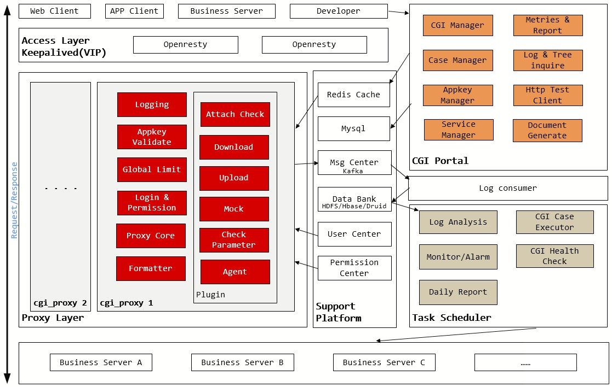

# http-proxy

高性能http代理服务

High performance HTTP proxy services

### 代理服务特性

先说一下几个角色

* 第三方（服务） -- 接口提供方，被调方
* 调用方（应用）  -- 主调方 ，它可以是一个客户端如浏览器、手机APP，也可以是另一个接口提供方（第三方、服务）。
* 代理平台 -- 请求转发平台。
* 代理管理平台 -- 可视化配置及查询调用方、第三方、请求日志等数据，
* 鉴权平台 -- 基于 cookie、token等方式的含登录、权限控制的用户中心

代理平台主要有以下特性

#### 松耦合、消除客户端开发等待。
代理平台除可以正常转发请求外，还可以伪装响应，即**代理平台直接按预定规则随机生成响应给调用方，并不请求第三方**。

#### 统一输入输出格式
**严格控制输入格式、标准化输出结构。第三方可以不按结构响应，但是需要在代理管理平台定义转换规则**。如果很多事情按照约定来，可以少很多工作。这也是许多框架所倡导的约定优于配置。

#### 规范CGI文档
通过统一的页面，统一录入接口说明、参数说明、响应头及字段说明等等。客户端开发甚至不需要跟后台开发沟通，即可完成开发任务。同时也提高接口的复用性。可以提供相应的注解和注释包，开发者在代码中引入注解或者注释，可以自动完成接口数据在平台上的录入、更新等操作。

#### 输入初步验证
在代理平台定义好入参规则，**代理平台在收到请求时，统一对输入参数进行格式验证、必填验证等等**。对恶意输入请求进行拦截并记录。

#### 频率控制
代理平台对每个接口提供基于分钟频次或者超频验证码的调用频率控制能力

#### 接口性能统计
统计从平台向第三方发起请求，到平台完全收到第三方的响应的时间，做为第三方接口的性能。

#### 请求日志
目标请求接口，来源ip、请求报文、响应报文、成功状态、耗时、所属的调用树等等整个请求完整的上下文数据，都记录在案。**并且，请求到达接口提供方之后，如果第三方处理出现异常，可以将异常日志反向上报到代理平台，由代理平台来关联这次请求的日志**。

#### 还原调用树（调用链路）
一个调用方请求到达第三方后，有可能级联发起更多的请求。如果这些请求全部经过代理平台。那么代理平台可以记录链路数据，后续在代理管理平台上**可视化的还原、呈现整个调用链路，清楚标识每个被调节点的耗时、是否成功等数据**，有助于排查故障、性能瓶颈等问题

#### 统一鉴权
**登录态检查和接口权限控制可以全部收归代理平台**。如果请求转发到了第三方接口，说明用户已登录并对此接口有权限，第三方开发者只需要从头部取封装好的userkey，到统一鉴权中心换取用户信息即可.

#### 协议头规范化及安全过滤
为防止后台响应一些不规范的头，或者一些http头部攻击进行过滤拦截。并且平台可以统一处理OPTIONS请求，将预定的协商头响应给客户端，可以灵活配置跨域需求。

#### 来源IP过滤
对接口可以提供IP白名单或者黑名单的功能，合法来源ip的请求才能被转发到后台

#### 多协议支持
能够支持多种接口协议，如HTTPS、WebSocket等等协议，也需要能直接支持TCP长连接、UDP数据报等协议。并能做到部分协议转换，**调用方无感知的使用跟第三方接口不同的协议通信**。

#### 关联测试用例
每个接口可以集成测试用例，类似于Advance REST Client或PostMan，**定时以用例对接口进行输入输出调用测试**。这可能需要接口提供方提供专门的测试接口。

#### 服务存活检查，多server时提供负载均衡
第三方可以提供部署服务的多个server ip，由**代理管理平台来进行存活检查**，但server不可用时从缓存中踢掉此server，**代理平台对多个server ip实现负载均衡**。server故障时向真实接口方发出告警。

#### 对第三方接口压测
代理平台本身需要具备较强的并发能力。但更重要的是接口本身支持高吞吐量访问。代理平台可以对第三方接口进行压测，以推进第三方优化接口性能及并发能力。

#### 接口缓存能力
对第三方接口提供可配置的缓存能力